# **Responsive Web Design Documentation 🌐**

**Introduction:**

In this section, we have created a table to show the responsive design of the our element game webpage across different devices. With validation and lighthouse result images.
Responsive web design (RWD) is a web design approach to *make web pages render well on all screen sizes and resolutions* while ensuring good usability.

Below here is the table for the website's user interface responsiveness in its early build:

|        Website Format        | Device Type |                                      Image                                      |
| :-----------------------------: | :-----------: | :-------------------------------------------------------------------------------: |
| Desktop Site (DarkMode) |   Laptop   |    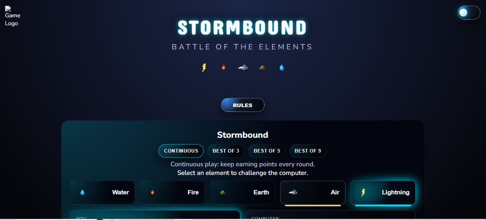    |
| Desktop Site (DarkMode) |   Laptop   |    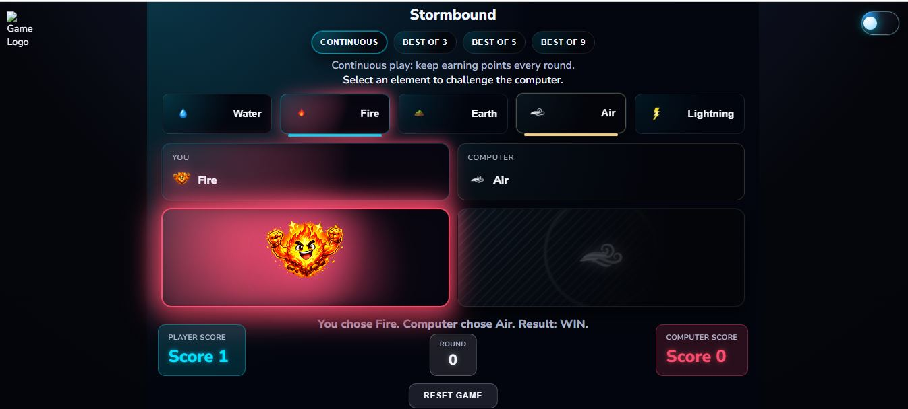    |
| Desktop Site (DarkMode) |   Laptop   |    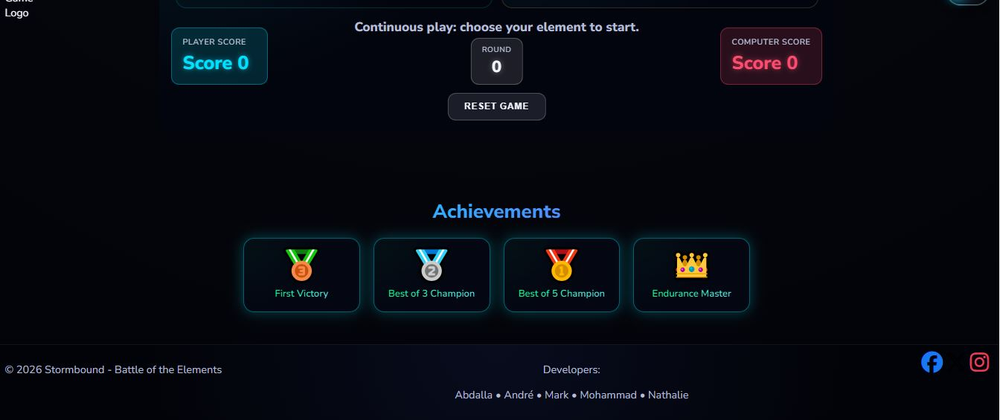    |
| Desktop Site (LightMode) |   Laptop   | 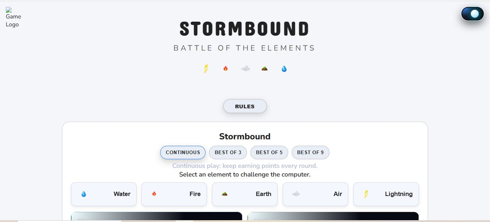 |
| Desktop Site (LightMode) |   Laptop   | 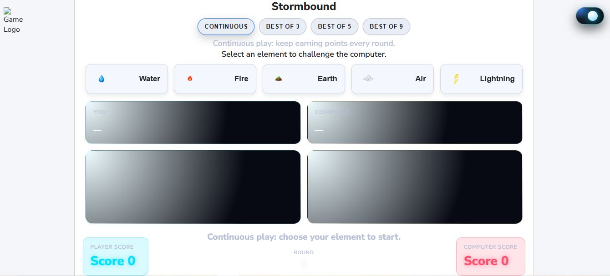 |
| Desktop Site (LightMode) |   Laptop   | 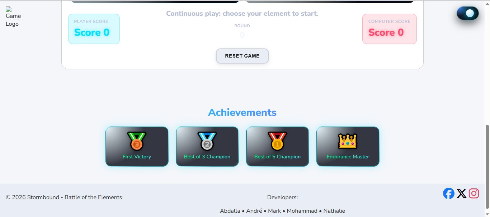 |
|     Iphone 14 Mobile Site     |   Mobile   |  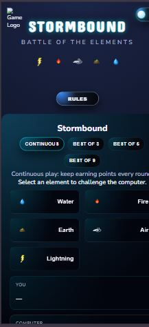  |
|     Iphone 14 Mobile Site     |   Mobile   |  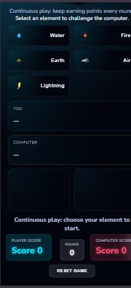  |
|     Iphone 14 Mobile Site     |   Mobile   |  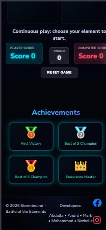  |
| Iphone 14 Mobile Site (light) |   Mobile   |  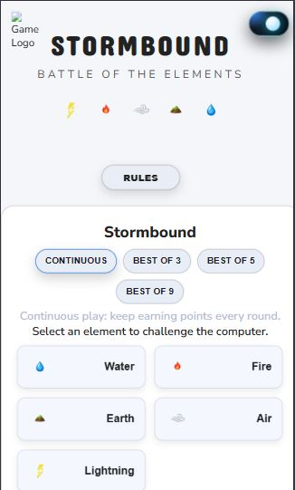  |
| Iphone 14 Mobile Site (light) |   Mobile   |  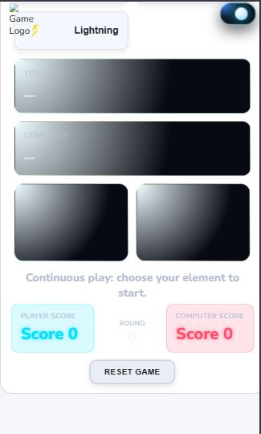  |
| Iphone 14 Mobile Site (light) |   Mobile   |  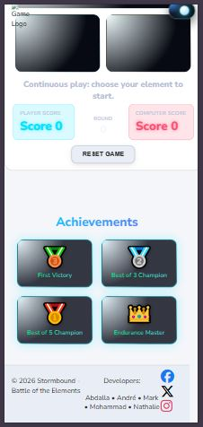  |
|      Tablet Site (Dark)      |   Tablet   |          |
|      Tablet Site  (Dark)      |   Tablet   |     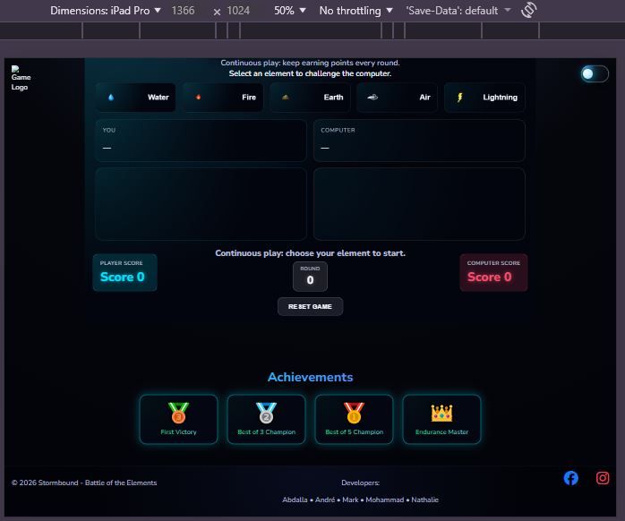     |
|     Tablet Site  (light)     |   Tablet   |  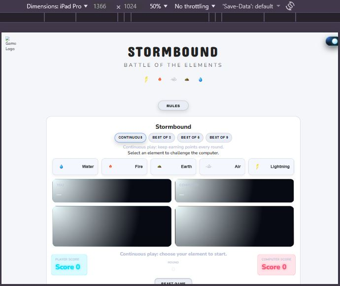  |
|          Tablet Site          |   Tablet   |  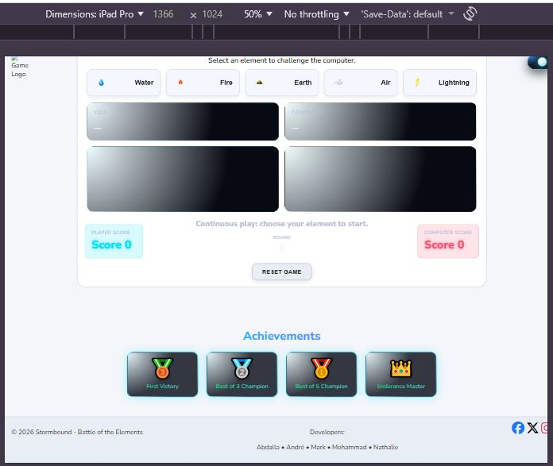  |

Summary on our table snippets:
All our web interfaces work perfectly and align with different device types.

**WEBSITE COMPLETION RESPOSNIVENESS**

In this section, we showcase our final website completion snapshots shown below.

Mobile:
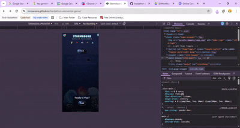

Laptop and Desktop:

### Lighthouse Testing

Mobile Lighthouse Test:
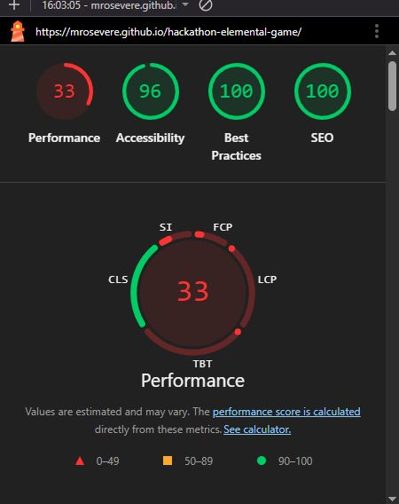

Desktop Lighthouse Test:
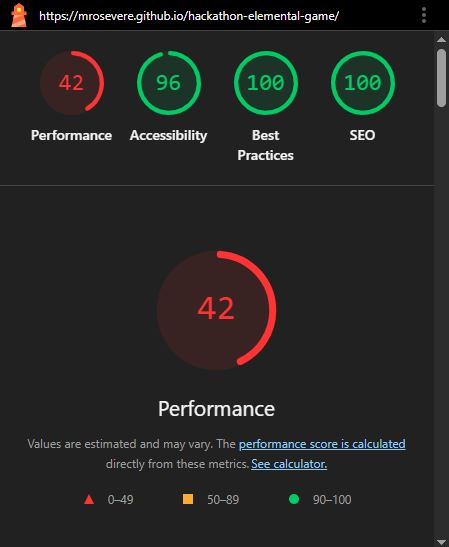

### HTML Validation

HTML Validation came up with these results:
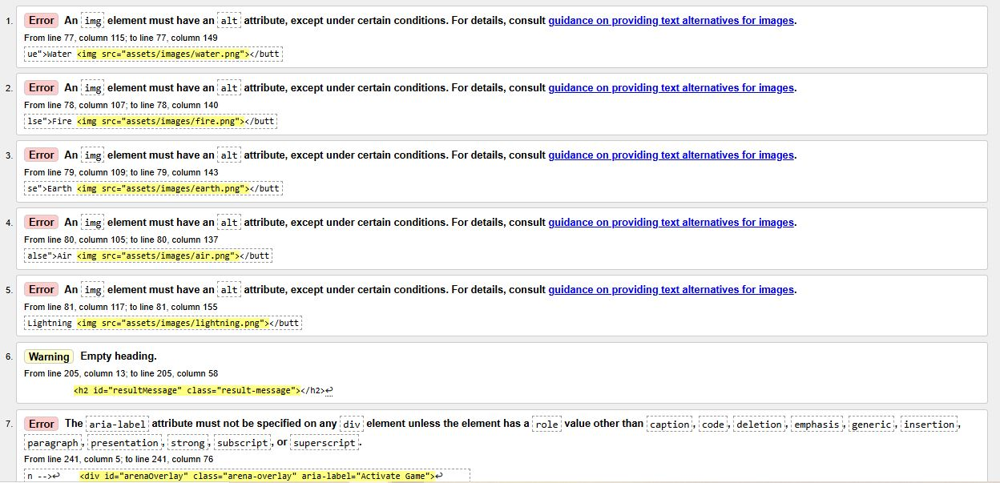
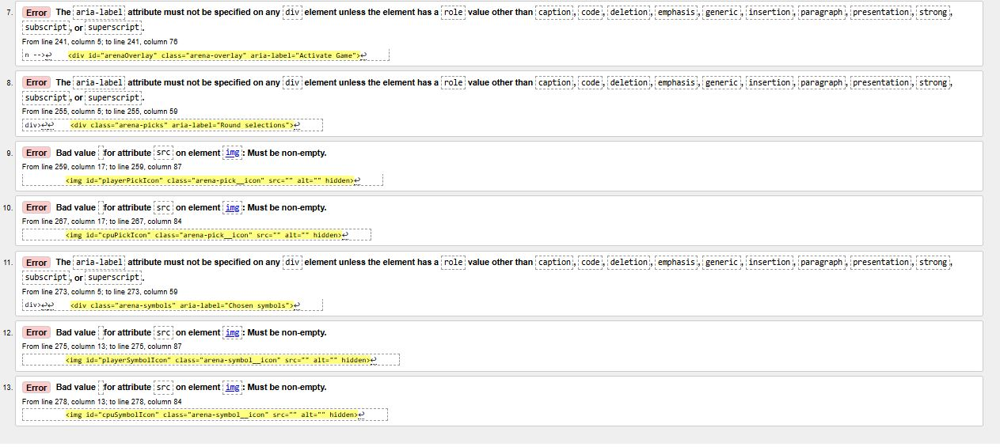

### CSS Validation

### JS Validation
